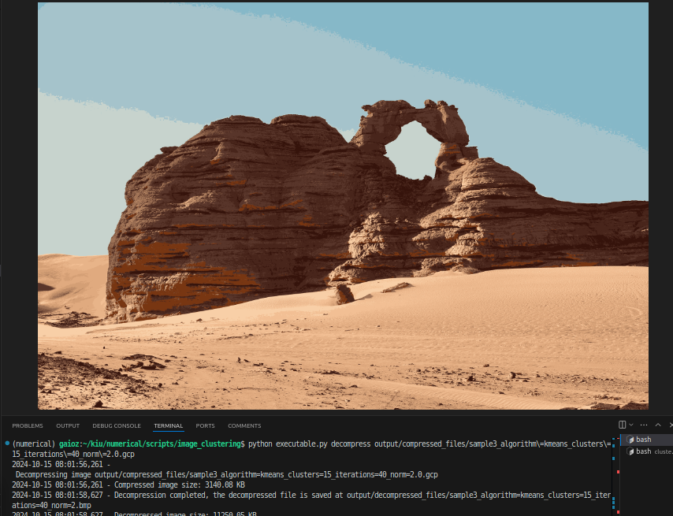

# Image Clustering and Image Compression with K-means & K-medoids

This project demonstrates image clustering and and it's application in image compression using K-means and K-Medoids algorithms. The objective is to reduce the number of unique colors in image by grouping similar colors into clusters, and come up with a way to effectively reduce the space.

## Table of Contents

- [Overview](#overview)
    - [Small Description](#small-description)
    - [Project Structure](#project-structure)
- [Installation](#installation)
- [Usage](#usage)
  - [Running Clustering](#running-clustering)
  - [Running Compression](#running-compression)
  - [Running Decompression](#running-decompression)

- [AP1 Tasks](#ap1-tasks)
    - [1: Implement K-means and K-medoids Clustering Algorithms](#1-implement-k-means-and-k-medoids-clustering-algorithms)
    - [2. Develop tests with synthetic data:](#2-develop-tests-with-synthetic-data)
        - [2.1 both assigned methods are accurate for a selected dataset](#21-both-assigned-methods-are-accurate-for-a-selected-dataset)
        - [2.2 one method is better than another for a selected dataset](#22-one-method-is-better-than-another-for-a-selected-dataset)
        - [2.3 clearly state criteria for comparing the methods](#23-clearly-state-criteria-for-comparing-the-methods)
        - [2.4 consider both, matrix and vector norms](#24-consider-both-matrix-and-vector-norms)
    - [3. Explanations of tests and conclusions should be provided in writing.](#3-explanations-of-tests-and-conclusions-should-be-provided-in-writing)
    - [4. Real world applications of clustering algorithms](#4-real-world-applications-of-clustering-algorithms)
    - [5. Conclusion](#5-conclusion)

- [Acknowledgements](#acknowledgements)


## Overview


### Small Description

This project offers 

1. fast and parameterized K-means and K-medoids clustering for images. 
2. allowing you to compress .bmp files while specifying the number of clusters and the algorithm to use. 

  - More clusters (e.g., K=20) result in higher-quality images, where the difference is nearly invisible to the human eye.
  - However, increasing the cluster count slows down the algorithm and reduces space savings.


The compression process reads a .bmp image, applies clustering, and saves the clustered image as a binary file in a custom .gcp format. This is the binary file format that I came up with. (standing for .gcp = gaioz compression) This format uses linear compression, optimizing for repeating colors to keep the file size small. The decompression process reads the .gcp file and reconstructs the clustered image. The output image is a .bmp file that can be viewed with an image viewer.


The Clustering algorithms are implemented from scratch using numpy. I optimized optimized for speed. Most of code is vectorized, avoiding python loops as much as possible. This is 1000 times faster than the initial version with python loops. 

The K-means and K-medoids algorithms are implemented in the clustering.py file. The KMeans class contains the K-means algorithm, and the KMedoids class contains the K-medoids algorithm. The ImageCompression class contains the compression and decompression methods.

The executable.py file contains the command-line interface (CLI) to run the image clustering, compression, and decompression. The CLI uses the argparse library to parse command-line arguments and execute the appropriate commands.

### Project Structure

The project is structured as follows

```
image_clustering
├── executable.py
├── input_images                    # Sample images to test the project that I already provided
│   ├── kmedoidsonclustered.bmp     
│   ├── sample1.bmp
│   ├── sample2.bmp
│   └── sample3.bmp
├── output                           # Default directories to save the output files
│   ├── clustered_images
│   ├── compressed_files
│   └── decompressed_files
├── README.md
├── requirements.txt
├── src
│   ├── clustering                  # Contains the clustering algorithms
│   │   ├── commons.py              # methods cost calculation, selection of random centroids, etc.
│   │   ├── image_clustering.py     # Contains the K-means and K-medoids algorithms
│   │   └── main.py                 # Useful wrappers for the clustering algorithms
│   ├── compression
│   │   ├── image_compression.py    # Contains the ImageCompression class for image compression and decompression
│   │   └── main.py                 # Useful wrappers for the compression algorithms
│   ├── constants.py
│   └── utils.py
└── tests                           # Unit tests that were used todevelop the project
    ├── test_commons.py             # Tests for the commons.py file
    └── test_image_compression.py   # Tests for the image_compression.py file
```

Note: K-medoids is trash and very slow for every real case. It is just for the demo purposes.


## Installation


Make sure you have the following installed:

- Python > 3.8

Clone the repository
- git clone https://github.com/qaioz/image_clustering.git

Optional: Create and activate a virtual environment

```bash
python -m venv venv
```

```bash
source venv/bin/activate  # Linux

venv\Scripts\activate  # Windows
```

Install the required packages

```bash
pip install -r requirements.txt
```

Set the **PYTHONPATH** environment variable to the root of the project

```bash
export PYTHONPATH=. # Linux

set PYTHONPATH=. # Windows
```


## Usage

The most basic usage is to run the script from the command line by executing python executable.py. You can perform image clustering, compression, and decompression through the following commands.

### Running Clustering

The cluster command clusters the colors in an image using K-means or K-medoids algorithms, 
and saves the clustered image as a .bmp file.

```bash
python executable.py cluster input_images/sample2.bmp --algorithm kmeans --n_clusters 15 --iterations 20 --norm 2 --output_file output/clustered_images/clustered_sample2.png
```
- **`input_images/sample2.bmp`** *(Positional Argument)*: The path to the input image. In this case, it is `input_images/sample2.bmp`.
- **`--algorithm`** *(Optional)*: The clustering algorithm to use. Options are `kmeans` or `kmedoids`. Default is `kmeans`.
- **`--n_clusters`** *(Optional)*: The number of clusters (color groups) to create. Default is `10`.
- **`--iterations`** *(Optional)*: The maximum number of iterations for clustering. Default is `10`.
- **`--norm`** *(Optional)*: Float value to specify the norm to use for distance calculation. Default is `2`, acts like the np.linalg.norm argument 'ord'.
- **`--output_file`** *(Optional)*: The path to save the clustered image. If not provided, it will generate a file in the `output/clustered_images` directory.

### Running Compression
```bash
python executable.py compress input_images/sample2.bmp --algorithm kmeans --n_clusters 10 --iterations 10 --norm 2 --output_file output/compressed_files/sample2.gcp
```

Arguments are the same as the clustering command, except for the output file. The output file is a .gcp file that contains the compressed image data.

### Running Decompression
```bash
python executable.py decompress output/compressed_files/sample2.gcp --output_file output/decompressed_images/sample2.bmp
```
easy to understand, i hope.

## AP1 Tasks

Here, I will explain the requirements of the AP1 tasks and demonstrate my solutions.

### 1: Implement K-means and K-medoids Clustering Algorithms

This task is accomplished in the `src/clustering` module.

1. **Implementation of Common Methods**:
    - First, I implemented and thoroughly tested methods in `commons.py`.
    - These methods include:
        - **Cost Calculation**: To assess the current clustering performance.
        - **Partitioning**: To organize the image data according to clusters.

2. **Implementation of Image Clustering**:
    - The main clustering logic is contained within `image_clustering.py`.
    - The implementation closely follows the lecture notes for consistency and understanding.

3. **Implementation Insights**:
    - **Color Reduction**: Before clustering, I filtered the image to retain only unique colors. This is crucial because large images can have up to 50 times more pixels than unique colors. By focusing on unique colors, we can significantly reduce the dataset size and improve performance.
    - **Tracking Color Frequency**: While keeping only unique colors, I ensured to track how often each color appears. This information is vital for accurate cost calculations during clustering.
    - **Numpy Vectorization**: To enhance performance, I leveraged Numpy's vectorized operations wherever possible. Relying on pure Python loops would lead to performance bottlenecks and longer processing times.
    - **Memory Management**: I was mindful of potential memory overflows, particularly with large images. To mitigate this, I implemented processing in chunks to keep memory usage manageable.

### 2. Develop tests with synthetic data:

#### 2.1 both assigned methods are accurate for a selected dataset


To test the accuracy we just need to run the algorithm and observe how much the clustering is starting to resemble the original image as the number of clusters increases. 


I have sample images in the `input_images` directory that can be used for testing. 

sample1, sample2, sample3, are same image with different sizes. I will use mostly sample2, its 1280x1920, big, even it does not take much time to process. sampl3 is little too heavy but still nothing terrible.

For the K-means algorithm, I can not use these images, as the number of unique colors is them is so high that k-medoids will take infinite time to process. Instead to test k-medoids, I first clusterd the sample2 image with k-means and left 50 colors: input_images/sample2_50_colors.bmp. I will use this image to test k-medoids.


##### K-means

To test K means, execute following commands with different norm and number of clusters argumets:

Image should be gradually improved as the number of clusters increases.

Takes about 2 minutes to process all of them on my device.

```bash
python executable.py cluster input_images/sample2.bmp --iterations=40 --norm=2 --n_clusters=2
&&
python executable.py cluster input_images/sample2.bmp --iterations=40 --norm=2 --n_clusters=3
&&
python executable.py cluster input_images/sample2.bmp --iterations=40 --norm=2 --n_clusters=6
&&
python executable.py cluster input_images/sample2.bmp --iterations=40 --norm=2 --n_clusters=10
&&
python executable.py cluster input_images/sample2.bmp --iterations=40 --norm=2 --n_clusters=20
&&
python executable.py cluster input_images/sample2.bmp --iterations=40 --norm=2 --n_clusters=50
```

Uploading every image on git is not practical, but here is an example of k means 40 iterations with 3 clusters:


##### K-medoids

To test K-medoids, execute following commands with different norm and number of clusters argumets:

Image should be gradually improved as the number of clusters increases.

Takes about 2 minutes to process all of them on my device.

```bash
python executable.py cluster input_images/sample2_50_colors.bmp --algorithm=kmedoids --iterations=40 --norm=2 --n_clusters=2
&&
python executable.py cluster input_images/sample2_50_colors.bmp --algorithm=kmedoids --iterations=40 --norm=2 --n_clusters=3
&&
python executable.py cluster input_images/sample2_50_colors.bmp --algorithm=kmedoids --iterations=40 --norm=2 --n_clusters=6
&&
python executable.py cluster input_images/sample2_50_colors.bmp --algorithm=kmedoids --iterations=40 --norm=2 --n_clusters=10
&&
python executable.py cluster input_images/sample2_50_colors.bmp --algorithm=kmedoids --iterations=40 --norm=2 --n_clusters=20
&&
python executable.py cluster input_images/sample2_50_colors.bmp --algorithm=kmedoids --iterations=40 --norm=2 --n_clusters=50
```

Here is what I got for k-medoids 40 iterations with 3 clusters:


### 2.2  one method is better than another for a selected dataset

Nearly in every case, K-means is better than K-medoids. It's impossible to implement k-medoids for image that have over 1000 unique colors, and every image I saw has tens of thousands of unique colors.

When there are many unique colors, taking the means of each cluster does not change the texture at all as we see from the observations above, so there is no benefit of using k-medoids.

But for the sake of the assignment, I can still come up with a scenario where k-medoids might be better than k-means.

Imagine somebody for some reason is clustering an image that has only several dominant, important colors, like Red, Green, Blue, allow shades of them but not very distinct from the main colors(still dont have more than 200-300 different shades to make k-medoids possible and not run forever). Lets say you also have some noise in the image. These noise colors are not dominant to the eye, but they are still there and very different from the main colors.
If K means chooses a noise color as an initial centroid, it might affect the averages so much that at the end, we can end up with a cluster that is noticeably different from the main color. But if we use k-medoids, we can be sure that the noise colors will not affect the result, as the medoid will be one of the main colors, not the noise.

Specifically to demonstrate this, I generated a synthetic image with 3 vertical red, green, blue stripes, and added 
noise as the 4th black color in the corners.

Run k-means with k=3 and wait for the case where the black color is chosen as the initial centroid. The result will be a worse. But if you run k-medoids, the result will be perfect every time.


This is the original image(see also input_images/noisy_image.bmp):


**K means command**

```bash
python executable.py cluster input_images/noisy_image.bmp --algorithm=kmeans --iterations=2 --norm=2 --n_clusters=3
```

As you can see in the terminal output, initially the black color is chosen as the centroid, resulting noticable different cluster to be formed.


**K medoids command**

```bash
python executable.py cluster input_images/noisy_image.bmp --algorithm=kmedoids --iterations=2 --norm=2 --n_clusters=3
```


The result always has the Red, Green, Blue colors as the centroids, and the noise is not affecting the result, cost is lower than k-means therefore the result is better.


### 2.3 clearly state criteria for comparing the methods

The criteria for comparing the methods are:

1. **Time Complexity**: There are tens of thousands of unique colors in the image, at the end of the day, time is more important becuse if one is ready in secods and the other is not ready at the end of the day, the one that is ready is better. In our case, time comlexity is so vastly different that it is the most important criteria.

2. **Final Cost**: The final cost of the clustering is important. The lower the cost, the better the clustering. Having more clusters and iterations will result in lower cost, but it will also take more time.


These criteria are also good for comparing the same methods with different parameters. Having more clusters and iterations will result in lower cost, but it will also take more time, so finding the balance is important.

### 2.4 consider both, matrix and vector norms

Lets discuss the --norm argument of my commands.

To leverage the speed of numpy, I used the np.linalg.norm method for norm calculations, otherwise, this project was destined to be very slow and fail. In my code, --norm argument is passed to the np.linalg.norm method as the 'ord' argument.

Here is its documentation: https://numpy.org/doc/stable/reference/generated/numpy.linalg.norm.html

**Command to test sample2 image with different vector norms**

```bash
python executable.py cluster input_images/sample2.bmp --iterations=40 --norm='-inf' --n_clusters=5
&&
python executable.py cluster input_images/sample2.bmp --iterations=40 --norm=-5 --n_clusters=5
&&
python executable.py cluster input_images/sample2.bmp --iterations=40 --norm=0 --n_clusters=5
&&
python executable.py cluster input_images/sample2.bmp --iterations=40 --norm=1 --n_clusters=5
&&
python executable.py cluster input_images/sample2.bmp --iterations=40 --norm=2 --n_clusters=5
&&
python executable.py cluster input_images/sample2.bmp --iterations=40 --norm=3 --n_clusters=5
&&
python executable.py cluster input_images/sample2.bmp --iterations=40 --norm=10 --n_clusters=5
&&
python executable.py cluster input_images/sample2.bmp --iterations=40 --norm='inf' --n_clusters=5
```


#### results from vector norms

**Results from the above commands are at the output/clusted_images/results_from_vector_norms directory.**

We can say that for every norm > 0, result looks the same, among those, 1 norm is the worst with visible imperfections but still not bad. 

0 norm is the worse and the most detail is lost.

norms < 0 completely mess up the colors, but the objects are still recognizable.

#### results from matrix norms

Does not makes sense, I tried but got an error, I think it is not possible to use matrix norms in this case.


### 3. Explanations of tests and conclusions should be provided in writing.

Hopefully, I explained everything in the previous sections.

### 4. Real world applications of clustering algorithms

Image clustering with K-means does not have many real-world applications, (not to mention K-medoids) but one of the most important applications was the image compression, which is the main focus of this project.

Most real world and useful would be to apply K-means to png images(not jpeg, as it is already compressed).
png images are lossless, k-means can significantly reduce the size of the image without losing any quality.

But png already uses some kind of compression, I wanted to write everything from scratch, so I decided to compress bmp images.
**bmp images are not compressed at all, they are raw images, so they are the best for this project.**
I came up with a custom binary format to save and decompress the clustered bmp images.**I called my own format .gcp, standing for gaioz compression.**

The compression is lossy, meaning detail is lost, but the quality is still similar to human eye. The more clusters, the better the quality, but the more space it takes.

Now, I have decompression command, that will conver the .gcp file back to .bmp file, and the image will be the same as the original image, but with less detail. Basically if you want to view the image, you need to decompress it first, but decompressed image will be the same size as the original image. This can become much more useful if I wrote a program that can view the .gcp files directly, but I did not have time for that. Writing vscode plugin for that would be a good idea and easy and cool. I will do that definitely soon.

#### Demonstration of the compression and decompression

Lets compress the sample3 image with 15 clusters. It is 11 MB, lets see how much we can reduce it.


**Compression command**

```bash
python executable.py compress input_images/sample3.bmp --algorithm=kmeans --iterations=40 --norm=2 --n_clusters=15
```


As you can see, the compressed file is 2 MB, over 5 times smaller than the original image, at the cost of some detail
and 11 seconds of processing time.

Now lets decompress it and see how much detail is lost.

**Decompression command**

```bash
python executable.py decompress output/sample3_algorithm=kmeans_clusters=15_iterations=40_norm=2.0.gcp
```

Lets check the results, It took 2 seconds to decompress and the image is 11 MB again, and lets see is it different from the original image? check the decompressed_files directory.




Unnoticeable difference, but the file is 5 times smaller. This is the power of K-means clustering and image compression.


### 5. Conclusion

Too tired to write a conclusion.

## Acknowledgements

Thanks for chat-gpt for helping me with numpy, writing CLI, and argparse. I learned a lot from this project, and I am happy with the result. I hope you like it too.

Thanks for copilot for writing this README.md file, I would not be able to write it without you.

